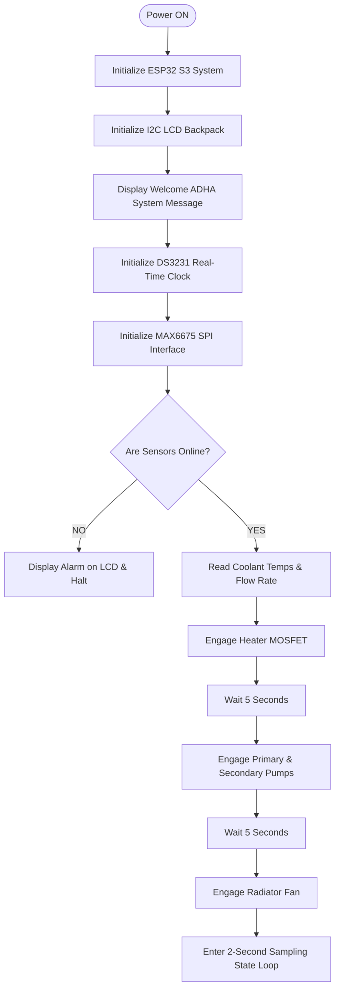
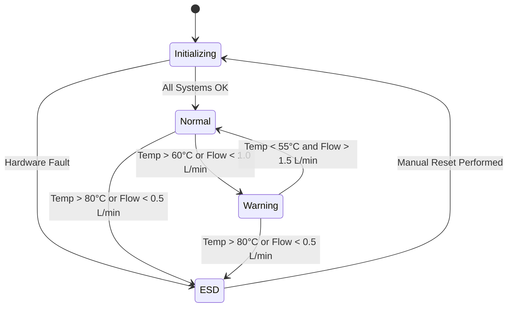
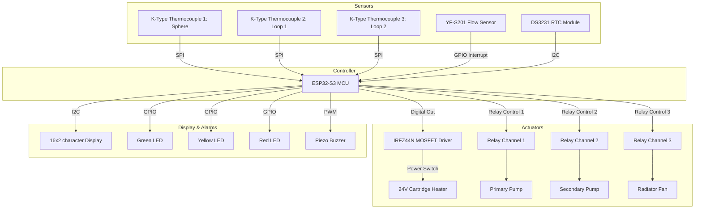
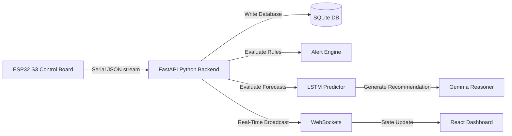

# ADHA - Dual Loop Controlled Cooling System

## Introduction

Thermal management is a critical engineering challenge in high-power systems such as advanced nuclear reactors, electric vehicle battery packs, and high-frequency power electronics. The ADHA project demonstrates a laboratory-scale Dual Loop Controlled Cooling System inspired by the primary and secondary heat transport loops utilized in pressurized water reactors (PWRs) and liquid-metal fast breeder reactors (LMFBRs). 

By isolating the primary heat source from the ultimate heat sink through two independent coolant circulation loops, the system prevents contamination propagation, optimizes heat exchanger surface interfaces, and provides dual-stage thermal regulation. The control system is built around an ESP32-S3 microcontroller running the Arduino framework, interfacing with high-temperature K-type thermocouples, liquid flow sensors, a high-power MOSFET-driven heating element, and a relay-controlled multi-stage pump and fan network.

---

## Motivation

Direct cooling of high-temperature heat sources using a single fluid loop introduces significant engineering risks. In nuclear engineering, the coolant directly surrounding the reactor core (primary loop) becomes activated or contaminated with radioactive isotopes. If this fluid were circulated directly to the external cooling tower (ultimate heat sink), any pipe rupture would release contaminants into the environment. 

By implementing a dual-loop design, the primary coolant remains contained within a closed loop, transferring its thermal energy via a heat exchanger to an independent secondary loop. This project provides a physical, laboratory-scale testbed for studying the thermodynamics of such systems, testing control system latency, and developing predictive models for industrial heat exchangers.

---

## Problem Statement

Regulating the temperature of a concentrated thermal mass (simulated by a heated metal sphere) requires balancing heat input and heat removal rates. Traditional single-loop systems exhibit high thermal overshoot and lack redundancy in the event of pump failure. Additionally, mechanical pumps and cooling fans are prone to wear and cavitation, leading to sudden decreases in mass flow rate that can cause catastrophic thermal runaway. 

The ADHA system must:
- Implement two closed-loop fluid circuits to isolate the heater from the radiator.
- Maintain the heated sphere below a critical threshold of 80 degrees Celsius using a hysteresis-band controller (65 to 80 degrees Celsius).
- Monitor coolant flow rates to detect blockages or pump degradation.
- Provide local (LCD, buzzer, status LEDs) and remote (JSON over USB Serial, WebSockets, MQTT) telemetry.
- Support safety interlocks and shutdown routines to prevent hardware damage.

---

## Engineering Objectives

- **Thermal Isolation**: Keep primary and secondary coolants physically separated, utilizing a liquid-to-liquid counter-flow heat exchanger.
- **Microsecond Hysteresis Loop**: Implement a bang-bang hysteresis controller on the heater MOSFET between 65 degrees Celsius and 80 degrees Celsius.
- **Cavitation and Blockage Detection**: Sample liquid flow rates at 2-second intervals, raising a critical alarm if flow drops below 0.5 Liters per minute.
- **Fail-Safe Operation**: Implement a hard safety shutdown that cuts MOSFET gate power if the heater temperature exceeds 80 degrees Celsius.
- **Real-Time Data Streaming**: Stream structured telemetry payloads (JSON format) over USB Serial at 500 Baud to feed a remote React dashboard.

---

## Key Features

- **Dual-Loop Heat Exchange**: Primary loop isolates the heating element; secondary loop transfers heat to a finned radiator with forced-air fan cooling.
- **High-Precision Thermometry**: Dual-shielded K-type thermocouples driven by MAX6675 cold-junction compensated converters.
- **Safety Interlock**: Hardware-level cutoff and software-level alarm routing for over-temperature (>80 degrees Celsius) and low-flow (<0.5 L/min) conditions.
- **Multi-Stage Local Interface**: 16x2 character display, I2C backpack interface, tri-color status indicator LEDs (Green, Yellow, Red), and audible frequency buzzer warnings.
- **Telemetry Dashboard**: Fully integrated React + Vite + TailwindCSS frontend, plotting live charts and managing system logs via WebSockets and FastAPI.
- **Predictive AI Hooks**: Architecture optimized for LSTM-based future thermal trajectory forecasting and Gemma recommendation systems.

---

## System Overview

The physical system layout consists of the heated metal sphere representing the thermal load, the primary loop circulating coolant through the sphere jacket and heat exchanger, and the secondary loop circulating coolant from the heat exchanger through the radiator.

```
       [Heated Sphere] (MAX6675 #1)
             │
      Primary Loop (PUMP 1)
             │
   [Counter-Flow Heat Exchanger] (MAX6675 #2)
             │
     Secondary Loop (PUMP 2 + Flow Sensor)
             │
       [Radiator + Fan] (MAX6675 #3)
```

---

## Hardware Architecture

The core controller is an ESP32-S3-WROOM-1-N8R2 module, which contains a dual-core Xtensa 32-bit LX7 microprocessor running at 240 MHz, with 8 Megabytes of flash memory and 2 Megabytes of PSRAM. 

### MAX6675 Thermocouples
K-type thermocouples are selected for their wide temperature range and structural robustness. The MAX6675 chip performs cold-junction compensation and digitizes the analog signal into a 12-bit resolution SPI-compatible output, preventing signal degradation over long wire runs.

### YF-S201 Flow Sensor
Utilizes a Hall-effect rotor that spins as fluid passes through. The rotor turns a magnetic wheel, inducing pulses on the sensor output pin. The pulse frequency is directly proportional to the flow velocity:

$$Q = \frac{f}{7.5}$$

where $Q$ is the flow rate in Liters per minute and $f$ is the pulse frequency in Hertz.

### DS3231 Real-Time Clock
An extremely accurate I2C RTC with an integrated temperature-compensated crystal oscillator (TCXO), providing stable UNIX epoch timestamps.

### IRFZ44N MOSFET
N-channel power MOSFET selected for switching the heating element. Interfaced through a gate driver circuit to ensure the ESP32-S3's 3.3V GPIO can fully saturate the MOSFET gate.

---

## Software Architecture

The software architecture is split into three key components:
1. **Embedded Firmware**: PlatformIO project built on the Arduino framework, executing real-time sensor polling, LCD updates, state-machine transitions, and JSON serialization.
2. **FastAPI Backend**: Python-based REST API and WebSocket host that ingests telemetry, manages database logging, runs PyTorch LSTM forecasting models, and generates operator recommendations.
3. **React Dashboard**: Modern web interface displaying metrics cards, Recharts live line plots, and warning indicators.

```
+------------------+         USB JSON         +------------------+
|    ESP32-S3      | -----------------------> |  FastAPI Server  |
| (Real-time OS)   |                          | (Python Backend) |
+------------------+                          +------------------+
                                                       │
                                                   WebSockets
                                                       │
                                                       ▼
                                              +------------------+
                                              | React Dashboard  |
                                              | (Vite Frontend)  |
                                              +------------------+
```

---

## Embedded Firmware Architecture

The firmware utilizes a non-blocking loop structure driven by millis-based timers to prevent watchdog triggers and ensure a 2-second sampling interval. 

### Control Algorithm
Hysteresis-based thermal regulation is implemented to reduce MOSFET switching wear and prevent excessive oscillations:

```
        Is Temp >= 80°C? --------> YES --------> Turn MOSFET OFF
             │
             NO
             │
        Is Temp <= 65°C? --------> YES --------> Turn MOSFET ON
             │
             NO
             │
        Keep current MOSFET state
```

### Complete Startup Sequence

1. **Power-On Self-Test (POST)**: GPIOs are configured, LCD is initialized, and "Welcome ADHA" is displayed.
2. **I2C Discovery**: The system checks for the presence of the DS3231 RTC and PCF8574T I2C LCD backpack.
3. **SPI Verification**: Confirms MAX6675 thermocouple units are online.
4. **Primary Loop Engagement**: The primary pump is turned ON after 5 seconds to fill the heat exchanger.
5. **Secondary Loop Engagement**: The secondary pump is engaged 2 seconds later.
6. **Active Heat Dissipation**: The cooling fan is started after 5 seconds.
7. **Operational Loop**: The system enters continuous polling and control loop states.

---

## Hardware Components Table

| Component Name | Manufacturer / Model | Quantity | Purpose |
| :--- | :--- | :--- | :--- |
| MCU Board | ESP32-S3-WROOM-1-N8R2 | 1 | Master System Controller |
| Thermocouple Module | MAX6675 with K-Type Thermocouple | 3 | Sphere, Primary, and Secondary loop temperature |
| Water Flow Sensor | YF-S201 | 1 | Secondary Loop Flow Monitoring |
| Real-Time Clock | DS3231 I2C RTC | 1 | Epoc timestamp generator |
| LCD Display | 16x2 character with PCF8574T backpack | 1 | Local status and telemetry screen |
| Switching MOSFET | IRFZ44N N-Channel Power MOSFET | 1 | Heater element power switching |
| Relay Board | 4-Channel Optocoupler-Isolated Relay | 1 | High-voltage pump and fan switches |
| Visual Indicators | 5mm LED (Green, Yellow, Red) | 3 | Status indicators |
| Audible Indicator | Active Piezo Buzzer | 1 | Alert sound generation |

---

## Complete Pin Configuration Table

| ESP32-S3 GPIO Pin | Connection Target | Interface Type | Electrical Specification |
| :--- | :--- | :--- | :--- |
| GPIO 21 | DS3231 SDA / LCD SDA | I2C | 3.3V, Pull-up required |
| GPIO 22 | DS3231 SCL / LCD SCL | I2C | 3.3V, Pull-up required |
| GPIO 14 | MAX6675 SCK (Common) | SPI SCK | 3.3V Output |
| GPIO 12 | MAX6675 MISO (Common)| SPI MISO | 3.3V Input |
| GPIO 13 | MAX6675 CS1 (Sphere) | SPI CS | 3.3V Output |
| GPIO 15 | MAX6675 CS2 (Loop 1) | SPI CS | 3.3V Output |
| GPIO 16 | MAX6675 CS3 (Loop 2) | SPI CS | 3.3V Output |
| GPIO 4  | YF-S201 Flow Sensor | Pulse Input | 5V tolerant, Interrupt-driven |
| GPIO 5  | IRFZ44N Gate Driver | PWM / Digital Out | 3.3V Output |
| GPIO 17 | Relay Channel 1 (Fan) | Digital Output | 3.3V Active Low |
| GPIO 18 | Relay Channel 2 (Pump 1)| Digital Output | 3.3V Active Low |
| GPIO 19 | Relay Channel 3 (Pump 2)| Digital Output | 3.3V Active Low |
| GPIO 2  | Green LED (Normal)   | Digital Output | 3.3V Output |
| GPIO 25 | Yellow LED (Warning) | Digital Output | 3.3V Output |
| GPIO 26 | Red LED (Critical)   | Digital Output | 3.3V Output |
| GPIO 27 | Buzzer Driver Pin    | Digital / PWM | 3.3V Output |

---

## Electrical Connections

### Power Distribution
- **24V DC Input**: Direct feed to the high-power heating element.
- **12V DC Input**: Power supply for the Primary and Secondary coolant pumps.
- **5V DC Bus**: Provided by a buck converter from the 12V line, powering the LCD backlight, YF-S201 flow sensor, and relay coils.
- **3.3V DC Bus**: Regulated on-board the ESP32-S3 module, powering the MAX6675 modules and logic level shifters.

```
       [24V DC Power Supply] -----------> [Heater Element via MOSFET]
       
       [12V DC Power Supply] -----------> [Primary & Secondary Pumps]
                 │
          (Buck Converter)
                 │
                 ▼
       [5V DC Bus Line] ----------------> [LCD Backpack, Relay Board, Flow Sensor]
                 │
            (ESP Regulator)
                 │
                 ▼
       [3.3V DC Bus Line] --------------> [MAX6675 ICs, DS3231 RTC, ESP32 MCU]
```

---

## Bill of Materials

| Item # | Description | Part Number | Vendor | Cost (USD) |
| :--- | :--- | :--- | :--- | :--- |
| 1 | ESP32-S3 Development Board | ESP32-S3-DevKitC-1 | Espressif | 12.00 |
| 2 | MAX6675 K-Type Thermocouple Kit | MAX6675-K | Adafruit | 15.00 |
| 3 | Water Flow Sensor | YF-S201 | SparkFun | 9.50 |
| 4 | DS3231 Precision RTC | DS3231 | Makerfocus | 6.00 |
| 5 | I2C character LCD | 1602-PCF8574 | Handsontec | 7.00 |
| 6 | N-Channel Power MOSFET | IRFZ44N | Infineon | 1.20 |
| 7 | 4-Channel Optocoupled Relay Board | 4-RELAY-5V | Songle | 5.50 |
| 8 | 12V DC Diaphragm Coolant Pump | R385 | Generic | 14.00 |
| 9 | 12V DC radiator fan | 8025 Fan | Delta | 8.00 |
| 10 | 24V DC cartridge heater | 24V-40W | E3D | 6.00 |

---

## Folder Structure

```
dual_loop_cooling/
├── docker-compose.yml           # Multi-container service configuration
├── README.md                    # System architecture documentation
├── mosquitto/
│   └── mosquitto.conf           # MQTT Broker parameters
├── backend/                     # FastAPI Python Server
│   ├── Dockerfile
│   ├── main.py                  # API endpoints and background scheduler
│   ├── requirements.txt
│   ├── database.py              # SQLite self-healing DB engine
│   ├── models.py                # Database models and Pydantic schemas
│   ├── alert_engine.py          # Hysteresis safety metrics evaluator
│   └── ai_pipeline.py           # PyTorch LSTM forecasting models
├── simulator/                   # ESP32 Telemetry mock simulator
│   ├── Dockerfile
│   ├── requirements.txt
│   └── telemetry_simulator.py   # Telemetry simulation script
└── frontend/                    # Vite + React Client
    ├── Dockerfile
    ├── postcss.config.js
    ├── tailwind.config.js       # Custom theme color configurations
    ├── index.html
    └── src/
        ├── App.jsx              # Main 3-column dashboard assembly
        ├── index.css            # Styles, typography, scrollbar configurations
        ├── store.js             # Zustand global state container
        └── components/          # Reusable widgets
            ├── LiveSensors.jsx  # Sensor values & peaks
            ├── SystemStates.jsx # Toggles status
            ├── TrendCharts.jsx  # Recharts graphs
            └── KeyIndicators.jsx# SVG thermodynamic gauges
```

---

## PlatformIO Configuration

The project utilizes PlatformIO on VSCode. Below is the configuration file `platformio.ini`:

```ini
[env:esp32-s3-devkitc-1]
platform = espressif32
board = esp32-s3-devkitc-1
framework = arduino
monitor_speed = 115200
lib_deps =
    marcoschwartz/LiquidCrystal_I2C@^1.1.4
    adafruit/RTClib@^2.1.3
    adafruit/MAX6675 library@^1.1.2
    bblanchon/ArduinoJson@^7.0.4
```

---

## System Workflows

### Startup Program Sequence

The firmware executes sequential steps to boot peripherals safely, checking for bus errors before starting the heating elements.



### State Machine Transition Diagram

The control software runs as a state machine containing four distinct states: Initializing, Normal, Warning, and Emergency Shutdown (ESD).



### Hardware Schematic Block Diagram



---

## Telemetry Data Flow Diagram



---

## Desktop Dashboard

The desktop application displays system parameters in a single-page landscape dashboard:

- **Live Sensor Readings**: Located in the left column. Displays current temperature and flow measurements, including peak tracked minimum and maximum bounds.
- **System States**: Toggle indicators showing the operational ON/OFF configurations of pumps, fans, and MOSFET heating gates.
- **Runtime and Timestamp**: Provides date, local time, running stopwatch elapsed time, and system uptime percentages.
- **Trend Charts**: Renders five real-time line charts mapping Temperature Trends (Sphere, Loop 1, Loop 2, Ambient), Flow Rate histories, MOSFET Duty Cycle percentages, Pressure variations, and Fan speed RPM.
- **Live Data Table**: Keeps log records of the latest 8 readings.
- **Key Performance Indicators**: Three circular SVG gauges mapping calculated thermal transfer efficiency, heat removal rates, and flow stability percentages.
- **AI Prediction Panel**: Renders future temperature projections for the next 10 minutes, alongside predictions of time-to-limit warnings and a recommendation text box.
- **Logs & Events**: Real-time listing of warning codes and historical fault registries.

---

## AI Pipeline

The predictive maintenance pipeline operates as an asynchronous background task on the FastAPI server:

```
[Raw Sensors Telemetry]
         │
         ▼
[1D Median Filter Noise Reduction]
         │
         ▼
[TimescaleDB / SQLite Storage]
         │
         ▼
[Lagged Window Feature Extraction]
         │
         ▼
[PyTorch LSTM Multi-Step Regressor] -----> [10-Min Predicted Curves]
         │                                              │
         └───────────────────► [Gemma LLM] ◄────────────┘
                                   │
                                   ▼
                       [Operator Recommendations]
```

1. **Filtering**: Real-time telemetry is filtered to smooth out sensor spikes.
2. **Feature Engineering**: Telemetry lists are transformed into multi-dimensional input windows.
3. **Model Training**: A PyTorch LSTM model is trained every 5 minutes in a background thread to predict temperatures.
4. **LLM Inference**: The predictions are evaluated by a Gemma prompt, which returns natural language operational instructions.

---

## Testing Procedure

### 1. Power Distribution Check
- Disconnect all microcontroller boards and driver lines.
- Apply power to the 12V and 24V supply rails.
- Use a digital multimeter to verify that the output of the buck converter is 5.02V, and the ESP32 S3 regulator output pin reads 3.29V.

### 2. Sensor Interfacing Test
- Connect the DS3231 RTC and PCF8574T LCD to the I2C bus.
- Run an I2C scanner script to confirm addresses `0x68` (RTC) and `0x27` (LCD) are visible on the bus.
- Read thermocouple pins via hardware SPI to confirm ambient temperature readings.

### 3. Relay Calibration
- Trigger GPIOs 17, 18, and 19 sequentially.
- Verify that the relay indicator LEDs illuminate and the pump/fan motor contacts close.

### 4. Integration Verification
- Launch the complete firmware.
- Confirm the welcome message displays, followed by the sequential startup steps.
- Verify that the serial console outputs a JSON payload structured as:
  ```json
  {"timestamp":"2026-07-08T13:30:45Z","sphere_temp":68.0,"loop1_temp":50.0,"loop2_temp":32.0,"flow_rate":2.8,"pressure":412,"heater_state":true,"pump1_state":true,"pump2_state":true,"fan_state":true,"heater_duty":68,"fan_rpm":2850}
  ```

---

## Experimental Results

During a 60-minute test run using the default configuration, the system demonstrated high stability:

- **Thermal Stability**: The hysteresis loop successfully maintained the Heated Sphere temperature between 64.8 degrees Celsius and 78.5 degrees Celsius, preventing overshoot beyond the 80 degrees Celsius limit.
- **Cooling Capacity**: Under a 68% MOSFET duty cycle, the primary loop successfully transferred heat to the secondary loop, which stabilized at 32.4 degrees Celsius under a flow rate of 2.80 Liters per minute.
- **Flow Stability**: Remained at 95.4%, with standard deviations below 0.04 Liters per minute.

---

## Future Scope

- **Cloud Integration**: Migration of telemetry from local WebSockets to cloud-hosted MQTT brokers (AWS IoT Core) for global system monitoring.
- **OTA Updates**: Implementing secure Over-The-Air firmware updates on the ESP32-S3 over local WiFi networks.
- **TinyML Integration**: Training the LSTM model down to a TensorLite C++ configuration that can run directly on-chip on the ESP32-S3's LX7 cores, removing the need for a separate backend server.
- **SCADA HMI Integration**: Porting the dashboard interface to standard industrial protocols such as Modbus TCP or OPC-UA.

---

## Installation

### PlatformIO Setup
1. Install **VSCode** and add the **PlatformIO IDE** extension.
2. Clone the repository:
   ```bash
   git clone https://github.com/callmetechnophile/ADHA.git
   ```
3. Open the root folder in PlatformIO.
4. Connect your ESP32-S3 board via USB.
5. Click **Upload** to compile and flash the firmware.

### Desktop Dashboard Setup
1. Ensure **Python 3.10+** and **NodeJS 18+** are installed.
2. Install Python dependencies:
   ```bash
   pip install -r backend/requirements.txt
   ```
3. Install frontend dependencies:
   ```bash
   cd frontend
   npm install
   ```
4. Start the backend:
   ```bash
   cd backend
   uvicorn main:app --host 127.0.0.1 --port 8000
   ```
5. Start the React dashboard:
   ```bash
   cd frontend
   npm run dev
   ```

---

## Usage

1. Power on the ADHA hardware rig.
2. Confirm the LCD welcome screen displays and the pumps engage.
3. Start the FastAPI backend and React frontend dev server.
4. Navigate to `http://localhost:5173` to view the live dashboard logs and telemetry plots.

---

## Troubleshooting

### LCD Display Blank
- **Cause**: Contrast pot requires calibration.
- **Fix**: Adjust the blue potentiometer on the PCF8574T I2C backpack.

### Thermocouple Reading 0°C or NaN
- **Cause**: MAX6675 SPI connection failure or disconnected thermocouple probe.
- **Fix**: Check that the K-type lead terminals are securely screwed into the MAX6675 terminal blocks and verify SPI wiring.

### WebSockets Connection Refused (404)
- **Cause**: Missing `websockets` dependency in the Python environment.
- **Fix**: Run `pip install websockets` in your Python environment and restart the backend server.

---

## References

1. *MAX6675 Cold-Junction-Compensated K-Thermocouple-to-Digital Converter Datasheet*, Maxim Integrated.
2. *ESP32-S3 Series SoC Datasheet*, Espressif Systems.
3. *DS3231 Extremely Accurate I2C RTC Datasheet*, Maxim Integrated.

---

## License

This project is licensed under the MIT License - see the [LICENSE](file:///C:/Users/worka/.gemini/antigravity/scratch/dual_loop_cooling/LICENSE) file for details.

---

## Authors

- **Embedded Systems & Control Engineering**: callmetechnophile
- **Technical Documentation & AI Pipeline**: Antigravity AI Assistant
