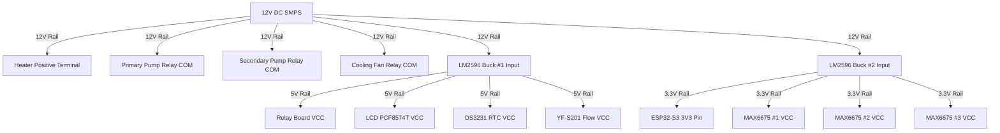
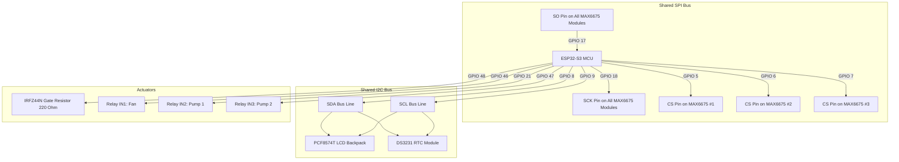

# Electrical Wiring & Connections Reference: ADHA

## Project Overview

The ADHA Dual Loop Controlled Cooling System requires a robust, low-noise power and signal routing network to safely manage high-current thermal loads alongside low-voltage sensor lines. The heart of the system is the ESP32-S3-WROOM-1-N8R2 microcontroller, which monitors three SPI-based K-Type thermocouple digitizers, an interrupt-driven Hall-effect water flow sensor, and an I2C-based timekeeper and display. The ESP32-S3 regulates temperature by switching a high-power heating element via a dedicated gate driver and N-channel power MOSFET, and engages coolant pumps and heat removal fans using an optocoupler-isolated relay board.

This document serves as the complete wiring manual, schematics key, and diagnostic reference for assembling the ADHA control panel.

---

## Wiring Philosophy

To prevent electromagnetic interference (EMI) from high-frequency switching elements (such as the MOSFET heater driver and motor coils) from corrupting sensor readings (particularly the microvolt-level inputs of the K-Type thermocouples), the wiring architecture adheres to the following rules:
- **Physical Separation**: Run high-current AC/DC power lines (Pumps, Fans, Heater power) in separate wiring bundles, isolated from SPI, I2C, and pulse-frequency sensor lines.
- **Common Ground Plane**: All grounds (12V, 5V, 3.3V, and signal grounds) must terminate at a single physical point (Star Ground Topology) to eliminate ground loops.
- **Gate Damping**: The MOSFET gate must be driven through a serial resistor (220 Ohm) to suppress high-frequency ringing, and secured with a pulldown resistor (10 kOhm) to prevent thermal runaway if the microcontroller GPIO floats during boot.
- **Optocoupler Isolation**: The relay board must be driven with isolated VCC inputs, keeping the ESP32-S3 logic rails separate from the relay coil supply.

---

## Power Distribution Architecture

The system runs on a 12V DC Switch Mode Power Supply (SMPS). Two independent LM2596 buck converters regulate down to 5V and 3.3V DC power buses.



---

## Complete GPIO Mapping Table

| ESP32 GPIO | Direction | Device | Target Pin | Signal Type | Logic Level | Purpose |
| :--- | :--- | :--- | :--- | :--- | :--- | :--- |
| GPIO 4 | Input | YF-S201 | Yellow Wire | Pulse Train | 5V (Tolerant) | Flow Rate Interrupt Input |
| GPIO 5 | Output | MAX6675 #1 | CS | Digital Out | 3.3V | Heater Temp Thermocouple Select |
| GPIO 6 | Output | MAX6675 #2 | CS | Digital Out | 3.3V | Primary Loop Temp Select |
| GPIO 7 | Output | MAX6675 #3 | CS | Digital Out | 3.3V | Secondary Loop Temp Select |
| GPIO 8 | Bi-Dir | LCD / RTC | SDA | I2C Data | 3.3V (Pull-up) | Shared I2C Data Bus |
| GPIO 9 | Output | LCD / RTC | SCL | I2C Clock | 3.3V (Pull-up) | Shared I2C Clock Bus |
| GPIO 17 | Input | MAX6675 (All)| SO | SPI MISO | 3.3V | Shared SPI Master In Slave Out |
| GPIO 18 | Output | MAX6675 (All)| SCK | SPI SCK | 3.3V | Shared SPI Clock Bus |
| GPIO 21 | Output | 4-Ch Relay | IN2 | Digital Out | 3.3V | Primary Pump Switch (Active Low) |
| GPIO 35 | Output | Red LED | Anode | Digital Out | 3.3V | Over-Temperature Alarm Output |
| GPIO 36 | Output | Yellow LED | Anode | Digital Out | 3.3V | Elevated Temp Warning Output |
| GPIO 37 | Output | Green LED | Anode | Digital Out | 3.3V | Normal Operation Status Output |
| GPIO 38 | Output | Active Buzzer| Positive | PWM / Out | 3.3V | Audible Warning Tone Output |
| GPIO 46 | Output | 4-Ch Relay | IN1 | Digital Out | 3.3V | Cooling Fan Switch (Active Low) |
| GPIO 47 | Output | 4-Ch Relay | IN3 | Digital Out | 3.3V | Secondary Pump Switch (Active Low)|
| GPIO 48 | Output | IRFZ44N Gate | Gate | Digital Out | 3.3V | MOSFET Heater Switching Trigger |

---

## Signal Connection Topology



---

## Power Distribution Table

| Source Rail | Current Max | Destination Component | Target Pin | Wire Color | Wire Gauge | Purpose |
| :--- | :--- | :--- | :--- | :--- | :--- | :--- |
| 12V DC SMPS | 10.0 A | Cartridge Heater | Positive Terminal | Red | 16 AWG | Primary heat source power feed |
| 12V DC SMPS | 1.0 A | Relay 1 Common | Common (COM) | Yellow | 20 AWG | 12V line feed for radiator fan |
| 12V DC SMPS | 1.0 A | Relay 2 Common | Common (COM) | Yellow | 20 AWG | 12V line feed for primary pump |
| 12V DC SMPS | 1.0 A | Relay 3 Common | Common (COM) | Yellow | 20 AWG | 12V line feed for secondary pump |
| 12V DC SMPS | 1.5 A | LM2596 Buck #1 | IN+ | Red | 22 AWG | 12V feed to 5V regulator |
| 12V DC SMPS | 1.5 A | LM2596 Buck #2 | IN+ | Red | 22 AWG | 12V feed to 3.3V regulator |
| 5V Buck #1 | 2.0 A | Relay Board | VCC | Red | 22 AWG | Relay coil driver power |
| 5V Buck #1 | 0.2 A | PCF8574T LCD | VCC | Red | 24 AWG | Backlight and LCD logic power |
| 5V Buck #1 | 0.05 A | DS3231 RTC | VCC | Red | 24 AWG | Timekeeper logic board power |
| 5V Buck #1 | 0.1 A | YF-S201 Flow | Red Wire | Red | 24 AWG | Hall-effect sensor power feed |
| 3.3V Buck #2 | 1.0 A | ESP32-S3 Board | 3V3 Pin | Red | 22 AWG | Microcontroller core logic supply |
| 3.3V Buck #2 | 0.05 A | MAX6675 #1 | VCC | Orange | 24 AWG | Thermocouple #1 digitizer chip |
| 3.3V Buck #2 | 0.05 A | MAX6675 #2 | VCC | Orange | 24 AWG | Thermocouple #2 digitizer chip |
| 3.3V Buck #2 | 0.05 A | MAX6675 #3 | VCC | Orange | 24 AWG | Thermocouple #3 digitizer chip |

---

## Component-Specific Connections

### 1. MAX6675 Thermocouple Modules

Three modules are wired to a shared SPI bus, using independent chip-select lines:

```
[ESP32 GPIO 18 (SCK)] ───┬──────────────────────┬──────────────────────┐
                         │                      │                      │
[ESP32 GPIO 17 (SO)]  ───┼──────────┬───────────┼──────────┬───────────┼──────────┬──────────┐
                         │          │           │          │           │          │          │
                       ┌─┴──────────┴─┐       ┌─┴──────────┴─┐       ┌─┴──────────┴─┐
                       │  MAX6675 #1  │       │  MAX6675 #2  │       │  MAX6675 #3  │
                       │   (Heater)   │       │   (Loop 1)   │       │   (Loop 2)   │
                       └─┬────────────┘       └─┬────────────┘       └─┬────────────┘
                         │                      │                      │
[ESP32 GPIO 5 (CS1)] ────┘                      │                      │
[ESP32 GPIO 6 (CS2)] ───────────────────────────┘                      │
[ESP32 GPIO 7 (CS3)] ──────────────────────────────────────────────────┘
```

#### MAX6675 Wiring Table
| Module Name | Module Pin | Connection Target | Target Pin | Voltage | Signal Type |
| :--- | :--- | :--- | :--- | :--- | :--- |
| **Module 1 (Heater)**| VCC | 3.3V Buck #2 | VCC Bus | 3.3V | Power |
| | GND | Ground Bus | Common Ground | 0V | Power |
| | SCK | ESP32-S3 | GPIO 18 | 3.3V | SPI Clock |
| | CS | ESP32-S3 | GPIO 5 | 3.3V | Digital Select|
| | SO | ESP32-S3 | GPIO 17 | 3.3V | SPI MISO |
| **Module 2 (Loop 1)**| VCC | 3.3V Buck #2 | VCC Bus | 3.3V | Power |
| | GND | Ground Bus | Common Ground | 0V | Power |
| | SCK | ESP32-S3 | GPIO 18 | 3.3V | SPI Clock |
| | CS | ESP32-S3 | GPIO 6 | 3.3V | Digital Select|
| | SO | ESP32-S3 | GPIO 17 | 3.3V | SPI MISO |
| **Module 3 (Loop 2)**| VCC | 3.3V Buck #2 | VCC Bus | 3.3V | Power |
| | GND | Ground Bus | Common Ground | 0V | Power |
| | SCK | ESP32-S3 | GPIO 18 | 3.3V | SPI Clock |
| | CS | ESP32-S3 | GPIO 7 | 3.3V | Digital Select|
| | SO | ESP32-S3 | GPIO 17 | 3.3V | SPI MISO |

---

### 2. I2C Bus Connections (LCD & RTC)

The 16x2 character display (via the PCF8574T backpack) and the DS3231 RTC share I2C lines:

| Component | Component Pin | Connection Target | Target Pin | Voltage | Signal Type | Purpose |
| :--- | :--- | :--- | :--- | :--- | :--- | :--- |
| **16x2 LCD** | VCC | 5V Buck #1 | VCC Bus | 5V | Power | Backlight and LCD driver power |
| | GND | Ground Bus | Common Ground | 0V | Power | Common Ground Return |
| | SDA | ESP32-S3 | GPIO 8 | 3.3V | I2C Data | Communication interface |
| | SCL | ESP32-S3 | GPIO 9 | 3.3V | I2C Clock | Sync Clock Line |
| **DS3231 RTC** | VCC | 5V Buck #1 | VCC Bus | 5V | Power | Timekeeper power rail |
| | GND | Ground Bus | Common Ground | 0V | Power | Common Ground Return |
| | SDA | ESP32-S3 | GPIO 8 | 3.3V | I2C Data | Communication interface |
| | SCL | ESP32-S3 | GPIO 9 | 3.3V | I2C Clock | Sync Clock Line |

---

### 3. YF-S201 Flow Sensor

The water flow sensor utilizes three wires and operates at 5V logic:

| Sensor Wire | Connection Target | Target Pin | Voltage | Signal Type | Purpose |
| :--- | :--- | :--- | :--- | :--- | :--- |
| **Red (VCC)** | 5V Buck #1 | VCC Bus | 5V | Power | Hall-Effect sensor supply |
| **Black (GND)**| Ground Bus | Common Ground | 0V | Power | Common Ground Return |
| **Yellow (Out)**| ESP32-S3 | GPIO 4 | 5V Pulse | Digital Pulse | Pulse train output from rotor wheel |

---

### 4. 4-Channel Relay Board

The relay module is optocoupler-isolated to keep motor noise away from the ESP32-S3 core:

| Relay Board Pin | Connection Target | Target Pin | Voltage | Signal Type | Purpose |
| :--- | :--- | :--- | :--- | :--- | :--- |
| **VCC** | 5V Buck #1 | VCC Bus | 5V | Power | Optocoupled coil power supply |
| **GND** | Ground Bus | Common Ground | 0V | Power | Common Ground Return |
| **IN1** | ESP32-S3 | GPIO 46 | 3.3V | Digital Out | Triggers Cooling Fan switch (Active Low) |
| **IN2** | ESP32-S3 | GPIO 21 | 3.3V | Digital Out | Triggers Primary Pump switch (Active Low)|
| **IN3** | ESP32-S3 | GPIO 47 | 3.3V | Digital Out | Triggers Secondary Pump switch (Active Low)|
| **IN4** | - | - | - | - | Reserved / Unconnected |

---

### 5. MOSFET Heater Driver Circuit

The N-channel IRFZ44N MOSFET switches the negative (ground return) leg of the 12V heating element:

| MOSFET Pin | Connection Target | Component / Node | Resistor Value | Voltage | Purpose |
| :--- | :--- | :--- | :--- | :--- | :--- |
| **Gate** | ESP32-S3 GPIO 48 | Series gate driver line | 220 Ohm | 3.3V | Current limiting damping |
| **Gate** | Ground Bus | Pull-down resistor | 10 kOhm | 0V | Secure gate low during MCU boot |
| **Source** | Ground Bus | Star Ground Terminal | None | 0V | Power return line |
| **Drain** | Heater negative | Cartridge Heater (-) | None | Up to 12V | Switched ground path to close circuit |

---

### 6. Indicators (LEDs & Buzzer)

All status indicator LEDs are connected in series with current-limiting resistors:

| Component | Target GPIO | Resistor Value | Anode Side | Cathode Side | Purpose |
| :--- | :--- | :--- | :--- | :--- | :--- |
| **Green LED** | GPIO 37 | 220 Ohm | GPIO pin via resistor | Ground Bus | Normal operation indicator |
| **Yellow LED** | GPIO 36 | 220 Ohm | GPIO pin via resistor | Ground Bus | Temperature > 60°C warning |
| **Red LED** | GPIO 35 | 220 Ohm | GPIO pin via resistor | Ground Bus | Temperature > 80°C critical shutdown|
| **Active Buzzer**| GPIO 38 | None | GPIO pin direct | Ground Bus | Alarm sound generator |

---

## Power Budget & Calculations

To ensure safety and reliability under worst-case scenarios, the power consumption of all system branches must be calculated:

### 12V DC Rail
- **Heater Element**: $R_{\text{heater}} = 3.6 \ \Omega \implies I_{\text{heater}} = \frac{12\text{V}}{3.6\ \Omega} = 3.33\text{ A}$ (at 100% duty cycle)
- **Primary Coolant Pump**: $12\text{V} \times 0.6\text{ A} = 7.2\text{ W}$
- **Secondary Coolant Pump**: $12\text{V} \times 0.6\text{ A} = 7.2\text{ W}$
- **Cooling Radiator Fan**: $12\text{V} \times 0.4\text{ A} = 4.8\text{ W}$
- **LM2596 Regulator Draws**: Up to $0.4\text{ A}$ under peak loads
- **Total Peak 12V Current**:

$$I_{\text{total\_12V}} = 3.33\text{ A} + 0.6\text{ A} + 0.6\text{ A} + 0.4\text{ A} + 0.4\text{ A} = 5.33\text{ A}$$

### 5V DC Bus (Buck Converter #1)
- **Relay Coils**: 4 active relays draw $4 \times 70\text{ mA} = 280\text{ mA}$
- **16x2 LCD Backlight**: Up to $120\text{ mA}$
- **YF-S201 Flow Sensor**: $15\text{ mA}$
- **DS3231 RTC Module**: $5\text{ mA}$
- **Total Peak 5V Current**:

$$I_{\text{total\_5V}} = 280\text{ mA} + 120\text{ mA} + 15\text{ mA} + 5\text{ mA} = 420\text{ mA}\ (2.1\text{ W})$$

### 3.3V DC Bus (Buck Converter #2)
- **ESP32-S3 Core Peak (WiFi active)**: Up to $450\text{ mA}$
- **MAX6675 Modules (3 units)**: $3 \times 1.5\text{ mA} = 4.5\text{ mA}$
- **Status LEDs & Buzzer**: $3 \times 15\text{ mA} + 20\text{ mA} = 65\text{ mA}$
- **Total Peak 3.3V Current**:

$$I_{\text{total\_3.3V}} = 450\text{ mA} + 4.5\text{ mA} + 65\text{ mA} = 519.5\text{ mA}\ (1.71\text{ W})$$

### Fuse & Wire Recommendations
- **Recommended SMPS Capacity**: 12V DC, 8.0 A minimum (96 W output capacity).
- **Main Power Input Fuse**: Inline fast-blow fuse rated at **7.5 A** placed on the positive terminal of the 12V supply.
- **Wire Gauges**:
  - **16 AWG Stranded**: Used for the 12V SMPS line, Star Ground, and cartridge heater paths.
  - **20 AWG Stranded**: Used for pump, fan, and buck regulator input lines.
  - **22 AWG Solid Core**: Used for regulator output buses (5V, 3.3V) and main ESP32-S3 feeds.
  - **24 AWG Solid Core**: Used for sensor hookups, logic signals, LEDs, and buzzer pins.

---

## Wire Color Code Recommendations

| Wire Color | Electrical Function | Target Voltage | Description |
| :--- | :--- | :--- | :--- |
| **Red** | Power Bus line | 12V DC / 5V DC | Primary positive power rails |
| **Orange** | Low-Voltage Power | 3.3V DC | Regulated MCU logic rail |
| **Black** | Common Return path | 0V (GND) | Shared Star Ground network |
| **Blue** | I2C Communication | 3.3V / 5V | I2C Serial Data (SDA) |
| **Green** | I2C Communication | 3.3V / 5V | I2C Serial Clock (SCL) |
| **Brown** | SPI Communication | 3.3V | SPI Serial Clock (SCK) |
| **Grey** | SPI Communication | 3.3V | SPI MISO / Serial Out (SO) |
| **White** | SPI Chip Select | 3.3V | SPI Chip Select (CS) |
| **Yellow** | Digital / PWM Signal| 3.3V / 5V | Gate control, LED anode, and buzzer lines |

---

## Electrical Assembly Procedure

1. **star Ground Setup**: Mount a central ground distribution block to form the Star Ground. Run a thick 16 AWG black wire from this block back to the SMPS negative terminal.
2. **Buck Regulator Calibration**:
   - Apply 12V to the inputs of both LM2596 modules.
   - Adjust the multi-turn potentiometers on the buck converters.
   - Using a multimeter, measure the outputs. **Adjust Buck #1 until it reads 5.00V, and adjust Buck #2 until it reads 3.30V** before making any connections to your controllers or sensors.
3. **Control Board Mount**: Mount the ESP32-S3 board onto your backplate. Connect the 3.3V regulator output to the ESP32 3V3 pin, and connect the GND pin to the Star Ground.
4. **Logic Bus Routing**: Run I2C and SPI bus lines to their terminal strips, keeping wire runs as short as possible.
5. **Sensor Installation**: Route the thermocouple wires and flow sensor lines. Secure MAX6675 shielding to the chassis ground to minimize EMI.
6. **High-Power Driver Assembly**: Mount the IRFZ44N MOSFET on a small heatsink. Solder the 220 Ohm series resistor to the gate pin, and the 10 kOhm pulldown resistor between the gate and source pins.
7. **Relay Box Hookup**: Wire the pumps and fan through the relay terminal blocks. Install flyback diodes (e.g., 1N4007) across all inductive pump motor terminals to protect the relays from inductive voltage spikes.

---

## Wiring Verification Checklist

- [ ] Measure the output voltages of the buck regulators to confirm they are exactly 5.0V and 3.3V.
- [ ] Verify that the resistance between the 12V, 5V, 3.3V positive rails and the Ground Bus reads as open circuit (no shorts).
- [ ] Confirm that the common ground terminal block has direct, low-resistance (<0.2 Ohm) continuity to all ground points (MCU, sensors, MOSFET, SMPS).
- [ ] Check that the flyback diodes across the pump motors are installed in reverse bias (cathode to positive, anode to negative).
- [ ] Confirm that the 10 kOhm gate pulldown resistor is installed between the MOSFET gate and source pins.

---

## Multimeter Diagnostics & Expected Voltages

Verify these voltage levels before running the system firmware:

| Test Point Name | Probe (+) Location | Probe (-) Location | Expected DC Voltage | Tolerable Limits | Action if Out of Range |
| :--- | :--- | :--- | :--- | :--- | :--- |
| **12V Rail** | SMPS Output V+ | Star Ground Bus | 12.00 V | 11.5V - 12.5V | Adjust SMPS output trimmer |
| **5V Rail** | Buck #1 Output V+| Star Ground Bus | 5.00 V | 4.85V - 5.15V | Adjust Buck #1 pot |
| **3.3V Rail** | Buck #2 Output V+| Star Ground Bus | 3.30 V | 3.20V - 3.40V | Adjust Buck #2 pot |
| **ESP32 Core** | ESP32 Pin 3V3 | ESP32 GND Pin | 3.30 V | 3.15V - 3.45V | Check regulator output |
| **MAX6675 VCC**| MAX6675 VCC Pin | Ground Terminal | 3.30 V | 3.20V - 3.40V | Check SPI bus voltage |
| **Relay Logic**| Relay Input Pin | Ground Terminal | 3.30 V (Logic High)| 3.00V - 3.45V | Verify ESP32 GPIO configuration |
| | Relay Input Pin | Ground Terminal | 0.00 V (Logic Low) | < 0.20V | Verify ESP32 GPIO configuration |
| **LCD Logic** | LCD VCC Pin | Ground Terminal | 5.00 V | 4.75V - 5.25V | Verify I2C bus wiring |

---

## Common Wiring Mistakes & Troubleshooting

### Problem: Thermocouple readings show random temperature spikes or read NaN
- **Mistake**: Common SPI clock/data lines are picked up by the 12V pump motor cables, causing electromagnetic interference (EMI).
- **Fix**: Re-route the MAX6675 cables away from motor wires. Wrap the thermocouple lines in shielded braid and connect the braid to ground.

### Problem: ESP32-S3 resets when a pump or cooling fan turns on
- **Mistake**: Voltage dip on the power line due to motor inrush current, or inductive spikes feeding back into the common ground.
- **Fix**: Connect a large electrolytic decoupling capacitor (e.g., 470 microfarad, 25V) across the 12V input terminals of the buck converters. Double-check that flyback diodes are installed across the motor terminals.

### Problem: MOSFET gets extremely hot when the heater is engaged
- **Mistake**: The MOSFET is not fully saturated (it is operating in its linear region) because the gate voltage is too low, or there is no gate series resistor.
- **Fix**: Verify that the gate driver is delivering a full 3.3V gate drive signal from GPIO 48. Ensure the gate pulldown resistor is installed to prevent voltage drift. If needed, use a logic-level gate driver IC (such as a TC4427) to drive the gate with a full 5V logic signal.
